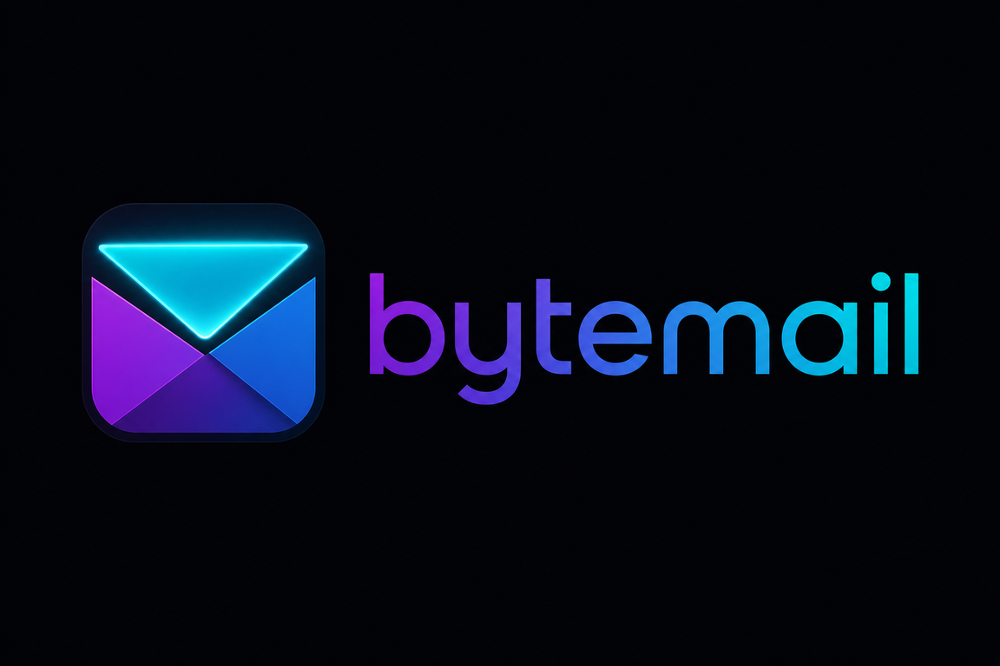

<p align="center">
  
</p>

# Local Multi-Agent Architecture & Engineering Standards | Synesis

This workspace runs a **Steve-orchestrated multi-agent team** inside Cursor: the human operator (Trish) works through **James** (sometimes *Jim*) as the session router, Steve coordinates discovery through delivery, and specialized subagents handle implementation, sync/API work, quality, and documentation. The stack is tuned for the Synesis Flutter/Dart local-first email and PIM client.

**V2 status (2026-07-27):** Waves 0–5 complete (account identity, dependency hygiene, PIM P0–P6 UI). **Wave 6** (cross-account DnD copy) is next — see [V2 Plan](docs/V2_PLAN.md).

---

## 1. The Team Roster

Agent definitions live in **two parallel locations** where present: GitHub Copilot-style [`.github/agents/*.agent.md`](.github/agents/) and Cursor subagent prompts [`.cursor/agents/*.md`](.cursor/agents/). Prefer the path your session actually loads; content should stay aligned.

### James / Jim | Cursor Session Router

*   **File:** *(none — Cursor chat coordinator for this session)*
*   **Type:** Operator interface / router (not a code-implementing subagent)
*   **Role:** Bridges the human operator and the Synesis agent team inside Cursor
*   **Core Responsibility:** Routes prompts to Steve, keeps context coherent across turns, and surfaces Steve’s phase-gate handoffs back to the operator. Sometimes addressed as *Jim* — same role.

### 👑 Steve | Master Orchestrator

*   **Files:** [`.github/agents/steve.agent.md`](.github/agents/steve.agent.md) · [`.cursor/agents/steve.md`](.cursor/agents/steve.md)
*   **Type:** User-Invocable (Primary Interface)
*   **Role:** Project Manager & Senior Systems Architect
*   **Core Responsibility:** Primary engineering interface after James routing. Maps blast radius, delegates to the roster, enforces the five phase-gates, and lands waves only when quality and documentation gates pass.

### 🛠️ Jules | The Builder

*   **Files:** [`.github/agents/jules.agent.md`](.github/agents/jules.agent.md) · [`.cursor/agents/jules.md`](.cursor/agents/jules.md)
*   **Type:** Subagent (`user-invocable: false`)
*   **Role:** Senior Flutter/Dart Software Engineer
*   **Core Responsibility:** Complex and cross-cutting implementation — UI modules, BLoC/Cubit, Drift-facing features, and architectural refactors. Produces complete, operational structures with no placeholders.

### 🧱 Andi | Junior Staff Engineer

*   **Files:** [`.github/agents/andi.agent.md`](.github/agents/andi.agent.md) · [`.cursor/agents/andi.md`](.cursor/agents/andi.md)
*   **Type:** Subagent (`user-invocable: false`)
*   **Role:** Junior staff Flutter/Dart engineer assisting Jules
*   **Core Responsibility:** Day-to-day implementation — small UI fixes, mechanical migrations with a clear brief, widget tests from Renee checklists. Escalates sync/OAuth/Drift schema/architecture to Jules or Tesla via Steve.

### ⚡ Tesla | The Integration Specialist

*   **Files:** [`.github/agents/tesla.agent.md`](.github/agents/tesla.agent.md) · [`.cursor/agents/tesla.md`](.cursor/agents/tesla.md)
*   **Type:** Subagent (`user-invocable: false`)
*   **Role:** API, networking, and background synchronization specialist
*   **Core Responsibility:** Dart Isolate sync loops, OAuth/Entra flows, Microsoft Graph and IMAP/SMTP engines, MIME-heavy pipelines, and resilience (backoff, offline queues). Keeps all heavy work off the UI thread.

### 🛡️ Renee | The Gatekeeper

*   **Files:** [`.github/agents/renee.agent.md`](.github/agents/renee.agent.md) · [`.cursor/agents/renee.md`](.cursor/agents/renee.md)
*   **Type:** Subagent (`user-invocable: false`)
*   **Role:** Quality Engineering Manager
*   **Core Responsibility:** Defensive code review, edge-case analysis, boundary mapping, and test design. Produces wave-close **test deltas** for Page’s inventory update.

### 📚 Page | The Archivist

*   **Files:** [`.github/agents/page.agent.md`](.github/agents/page.agent.md) · [`.cursor/agents/page.md`](.cursor/agents/page.md)
*   **Type:** Subagent (`user-invocable: false`)
*   **Role:** Technical Documentation Specialist
*   **Core Responsibility:** Docstrings, architecture maps, README/roadmap/checklist maintenance, Gold Master header audits, and automated test inventory updates from Renee’s handoff.

---

## 2. Architectural Philosophy & Core Stack

The architecture prioritized across the Synesis platform emphasizes zero-lag performance, predictable state tracking, and reliable background synchronization.

*   **Data Paradigm:** Local-First Architecture. The UI layers must strictly read from the local SQLite database. The sync engine operates entirely in the background.
*   **Async Operations:** Utilize background Dart Isolates for all intensive networking (IMAP/SMTP/Graph API streams) and heavy MIME parsing to preserve 60fps UI fluidness.
*   **State Management:** BLoC / Cubit — Always stick strictly to this pattern for all UI filters, multi-tenant views, and view model updates. UI widgets must remain purely structural and reactive to state streams.
*   **Hybrid Connectivity:** Maintain separate engines based on account types (Microsoft Graph API via HTTPS for Exchange/Outlook; standard native secure IMAP/SMTP for Google and independent servers; CardDAV/CalDAV for PIM on IMAP-style accounts per [V2 Plan](docs/V2_PLAN.md)).

---

## 3. Code Quality & Engineering Standards

Every line of code touched or generated by **Jules** / **Andi** / **Tesla** and audited by **Renee** must adhere to the following baseline rules:

*   **Code Style:** Favor strong static typing, explicit type declarations on public APIs, strict trailing commas, and `const` constructors wherever Flutter performance optimization allows.
*   **Zero Placeholders:** Code generation loops must produce finished, operational structures. The use of `// TODO`, `...`, or truncated logic functions is strictly banned unless explicitly requested as a non-functional layout stub.
*   **Defensive Coding:** Ensure strict handling of null-safety, catch specific platform/network exceptions, and cleanly route failures through BLoC Error states rather than letting them crash the isolate loop.

---

## 4. File Header Automation

For all core or "Gold Master" Dart files, always prepend this exact file header format using Dart line comment syntax:

```dart
// ==============================================================================
// File: [File Path]
// Description: [Brief description of functionality]
// Component: [Architecture layer, e.g., UI / Bloc / Data / Sync]
// Version: 1.0 (Gold Master)
// Created: [YYYY-MM-DD]
// Last Update: [YYYY-MM-DD]
// ==============================================================================
```

---

## 5. Execution Policy & Phase-Gate Lifecycle

When a request is submitted through **James** to **Steve**, the workflow advances through five sequential operational gates before a solution is finalized:

```
[Operator] ──> James (router) ──> Steve
                                      │
                                      ▼
                    (1. Discovery: Steve & Page; Tesla if sync/API/OAuth/Isolate)
                                      │
                                      ▼
                    (2. Implementation: Jules and/or Andi; Tesla for integration scope)
                                      │
                                      ▼
                    (3. Quality Gate: Renee)
                                      │
                                      ▼
                    (4. Documentation: Page — incl. test inventory from Renee delta)
                                      │
                                      ▼
                    [Final Review] <-- (5. Polish & Delivery: Steve)
```

1.  **Discovery Phase:** Steve maps the blast radius of the change. Page assists when legacy or cross-module context mapping is needed. **Tesla branch:** If the task touches background Isolates, SQLite sync, OAuth, Graph API, IMAP/SMTP, or CardDAV/CalDAV, Steve routes integration design through **Tesla** (detailed prompt / specialized pass) before implementation begins — Steve does not freestyle sync or protocol code.

2.  **Implementation Phase:** Steve delegates complex or cross-cutting work to **Jules**, scoped day-to-day work to **Andi**, and integration/sync/OAuth/Isolate implementation to **Tesla** per the discovery plan. Andi escalates architecture, schema, and protocol questions back to Jules or Tesla.

3.  **Quality Phase:** Implementation output goes to **Renee** for vulnerability auditing, edge-case discovery, test design, and a **wave-close test delta** listing every automated test touched or added.

4.  **Documentation Phase:** Verified code and Renee’s test delta go to **Page** for docstrings, Gold Master headers, markdown/spec updates, and **automated test inventory refresh** (`docs/V1_AUTOMATED_TEST_INVENTORY.csv` via [`tool/generate_test_inventory.py`](tool/generate_test_inventory.py); see [TEST_INVENTORY.md](docs/TEST_INVENTORY.md)). **Wave-land gate:** Steve does not mark a wave landed until Page has updated the inventory for all tests in Renee’s delta (Renee delta → Page inventory → Steve sign-off).

5.  **Delivery Phase:** Steve reviews unified engineering, testing, and documentation artifacts against the original criteria and returns the solution to the operator via James.

### Strict Execution Constraints

*   **Terminal Usage:** Request human review and explicit confirmation before running any mutating shell commands, Flutter build runners, or script executions.
*   **File Management:** Always present a clear implementation plan before performing multi-file refactors, dependency updates in `pubspec.yaml`, or destructive file deletions.

---

## 6. Documentation & Defect Logging

*   **Defect Tracking:** Always document defects discovered in the codebase inside [`DEFECTS.md`](DEFECTS.md).
*   **System Updates:** Update `README.md`, architecture docs, and roadmap logs when landing major foundational features so Page’s records match reality.
*   **Multi-agent playbook:** Portable team workflow captured in [`docs/MULTI_AGENT_SYSTEM_PROMPT.md`](docs/MULTI_AGENT_SYSTEM_PROMPT.md) (V1 Final wave **FW-6**, complete).
*   **Automated test inventory:** Canonical catalog in [`docs/V1_AUTOMATED_TEST_INVENTORY.csv`](docs/V1_AUTOMATED_TEST_INVENTORY.csv); human-readable index in [`docs/TEST_INVENTORY.md`](docs/TEST_INVENTORY.md). Regenerate with [`tool/generate_test_inventory.py`](tool/generate_test_inventory.py). The live `flutter test` suite may exceed the catalog until the next Renee→Page inventory pass — treat the CSV as the versioned source of truth, not a hardcoded case count.
*   **V2 wave checklists & QA:** [V2 Plan](docs/V2_PLAN.md) · [Wave H — Dependency Hygiene](docs/WAVE_H_DEPENDENCY_HYGIENE.md) · [V2 Wave 2 Checklist](docs/V2_WAVE2_CHECKLIST.md) · [V2 Wave 2 QA](docs/V2_WAVE2_QA.md) · [V2 Wave 3 Checklist](docs/V2_WAVE3_CHECKLIST.md) · [V2 Wave 3 QA](docs/V2_WAVE3_QA.md) · [V2.0a P0 Checklist](docs/V2_0A_P0_CHECKLIST.md) · [V2.0a P0 QA](docs/V2_0A_P0_QA.md).
*   **Manual E2E:** [`docs/V1_MANUAL_E2E_MATRIX.csv`](docs/V1_MANUAL_E2E_MATRIX.csv) remains separate from the automated inventory.
*   **V1 wave checklists (historical):** W4–W7 compose/notifications/hardening checklists under `docs/` are V1 closure artifacts; link by `test_id` / wave filter via [TEST_INVENTORY.md](docs/TEST_INVENTORY.md) rather than treating them as active V2 gates.

---

## Related Docs

| Doc | Purpose |
| --- | --- |
| [docs/V2_PLAN.md](docs/V2_PLAN.md) | V2 roadmap, wave sequence, locked product decisions |
| [docs/ROADMAP.md](docs/ROADMAP.md) | Cross-version roadmap and milestone index |
| [docs/TEST_INVENTORY.md](docs/TEST_INVENTORY.md) | Automated test catalog index and regeneration |
| [docs/MULTI_AGENT_SYSTEM_PROMPT.md](docs/MULTI_AGENT_SYSTEM_PROMPT.md) | Portable multi-agent playbook (FW-6) |
| [docs/WAVE_H_DEPENDENCY_HYGIENE.md](docs/WAVE_H_DEPENDENCY_HYGIENE.md) | Pre-V2.0a dependency hygiene checklist |
| [DEFECTS.md](DEFECTS.md) | Running defect log |
