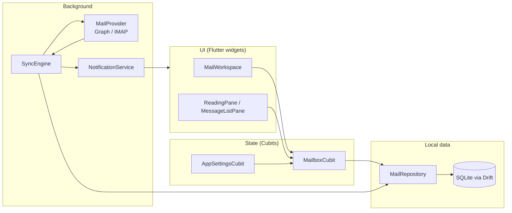

<p align="center">
  
</p>

# Dart in ByteMail — A Curious Engineer's Tour

**For:** Trish (product owner, curious engineer) and anyone who wants to read the codebase without becoming a Dart expert first.

**Not:** A language textbook, the product spec, or end-user documentation. For architecture without code, start with [ARCHITECTURE_OVERVIEW.md](ARCHITECTURE_OVERVIEW.md). For requirements, see [SPEC.md](SPEC.md). For how the team builds, see [AGENTS.md](../AGENTS.md).

---

## 1. Overview — Why Dart Here?

ByteMail is a **local-first email client** for **Windows** and **Android**. Dart is the language; **Flutter** is the UI toolkit that turns Dart into native apps on both platforms from one codebase.

That pairing is deliberate:

| Choice | What it means in ByteMail | Why it exists |
| --- | --- | --- |
| **Flutter** | One UI codebase compiles to Windows desktop and Android mobile | Ship both v1 platforms without maintaining two separate front ends |
| **Local-first + SQLite (Drift)** | Everything on screen reads from a local database file | Inbox opens instantly; offline still works; no spinner while waiting on the server |
| **BLoC / Cubit** | Widgets paint state; Cubits own navigation and mutations | Predictable one-way flow — UI never "secretly" edits data |
| **Isolates** | Background workers for CPU-heavy MIME assembly | Keeps the UI thread free for 60fps scrolling while building outbound multipart messages |
| **Hybrid protocols** | `GraphMailProvider` vs `ImapSmtpMailProvider` behind one `MailProvider` contract | Exchange/Outlook use modern HTTPS Graph; Gmail and others use classic IMAP/SMTP — the UI never cares which |

**The golden rule:** The UI **reads** SQLite. The **SyncEngine** **writes** SQLite (and enqueues remote jobs). User actions like "mark read" update SQLite first (optimistic), then queue sync work for the server.

Integration waves and test coverage are tracked in [V1_TIER_INTEGRATION.md](V1_TIER_INTEGRATION.md) and [TEST_INVENTORY.md](TEST_INVENTORY.md). **List filters** (ephemeral + saved presets) and **branding** (icon/splash) landed in Final wave Phases B and A — user-facing detail in [USER_GUIDE.md](USER_GUIDE.md).

---

## 2. Mental Model Diagram

When you wonder "where does this data come from?", trace this path:



**Read path:** Widget → Cubit → Repository → SQLite (often via a live `watchChanges` stream).

**Write path (sync):** MailProvider → SyncEngine → Repository → SQLite → stream fires → Cubit refreshes → UI repaints.

**Write path (user action):** Cubit → MessageActionService → Repository (local patch) → SyncEngine job queue → provider later.

---

## 3. Dart Concepts You'll See in ByteMail

Each item below is **only** what appears in this repo — not the full Dart language.

### `async` / `Future` / `await`

**Future** = "a value that will arrive later" (like a Promise in JavaScript). **async** functions return Futures. **await** pauses until the Future completes — without blocking the UI thread.

**ByteMail example:** `lib/main.dart` — startup is one long async chain: open SharedPreferences, open the database, wire SyncEngine, then `runApp(...)`. Nothing paints until the database and core services exist.

```dart
final SharedPreferences prefs = await SharedPreferences.getInstance();
final ByteMailDatabase database = ByteMailDatabase.open();
// ...
runApp(ByteMailApp(...));
```

### `Stream` + `watchChanges` / `BlocBuilder`

A **Stream** emits events over time. Drift-backed repositories broadcast "something changed" so Cubits can refresh without polling.

**ByteMail example:** `lib/repository/drift_mail_repository.dart` exposes `watchChanges()`. `lib/ui/mailbox/mailbox_cubit.dart` subscribes in `attachDbWatch()` and calls `refresh()` on each pulse.

**BlocBuilder** (from `flutter_bloc`) rebuilds a widget when a Cubit emits new state — e.g. `MailWorkspace` and panes listen to `MailboxCubit` instead of calling `setState` for mail data.

### Null safety (`?`, `??`, `required`)

Dart 3 assumes values are non-null unless marked optional.

| Syntax | Meaning | ByteMail touchpoint |
| --- | --- | --- |
| `String?` | Maybe null | `MailMessage.body` can be null until fetched |
| `??` | Default if null | Settings hydration: `map['themeId'] as bool? ?? true` in `app_settings_cubit.dart` |
| `required` | Constructor must receive this | Nearly every service constructor (`required MailRepository repository`) |

### `const` constructors

**const** widgets and objects are created at compile time and reused — cheaper rebuilds.

**ByteMail example:** `MailboxState()` defaults, `NoopDesktopController()`, theme tokens — you'll see `const` on immutable UI shells and state snapshots throughout `lib/ui/` and `lib/settings/`.

### Isolates

An **Isolate** is a separate memory heap — true parallel work without sharing mutable state on the UI thread.

**Where ByteMail uses them today:** `lib/mime/multipart_builder.dart` — `buildMultipartMessageInIsolate()` calls `Isolate.run()` to assemble outgoing MIME bytes before send. Sync and network I/O use **async/await** on the main isolate (sequential job loop in `sync_engine.dart`), but MIME assembly is the heaviest CPU path pushed off-thread.

### Packages vs `lib/`

| Location | Role |
| --- | --- |
| **`pubspec.yaml` + pub cache** | Third-party packages (`flutter_bloc`, `drift`, `connectivity_plus`, …) |
| **`lib/`** | ByteMail source, imported as `package:bytemail/...` |
| **`test/`** | Automated tests mirroring `lib/` structure |

Your product code lives under `lib/`; packages are dependencies you don't edit.

### Gold Master file headers

Core Dart files start with a comment block like:

```dart
// ==============================================================================
// File: lib/sync/sync_engine.dart
// Description: Sequential durable sync-job processor for local-first mail data.
// Component: Sync
// Version: 1.2 (Gold Master)
// ...
// ==============================================================================
```

**Gold Master** = reviewed, production-intent module (not a spike or placeholder). **Component** tells you which layer you're in: UI, Bloc, Data, Sync, Protocol, etc. When lost, read the header first.

---

## 4. Step-Through — Open App → Inbox → Mark Read → Sync Notifies

Follow this ordered path when exploring. Each stop: **role** and **why it exists**.

### Stop 1 — `lib/main.dart` (DI bootstrap)

**Role:** Application entrypoint. Initializes Flutter bindings, opens SQLite, constructs repositories, account service, provider registry, settings Cubit, desktop controller, notification service, and SyncEngine — then calls `runApp`.

**Why:** Keeps `app.dart` focused on widget tree wiring. All **dependency injection** (who gets which instance) happens here once. Also handles special cases: detached message windows on Windows, `.eml` file launch args, platform-specific notification adapters.

---

### Stop 2 — `lib/app.dart` (root MaterialApp + providers)

**Role:** Builds `ByteMailApp` — `MultiRepositoryProvider` for services (`MailRepository`, `SyncEngine`, `AccountService`, …) and `MultiBlocProvider` for `AppSettingsCubit` and `MailboxCubit`. Applies theme from settings and hosts `MailWorkspace` as the home route.

**Why:** Flutter widgets can't reach into globals cleanly; providers expose services to the subtree. One place to see everything the UI layer is allowed to touch.

---

### Stop 3 — `lib/settings/app_settings_cubit.dart` + `app_settings_state.dart`

**Role:** `AppSettingsCubit` loads and persists user prefs (theme, density, Focus toggles, retention, tray, notification filters) via `SharedPreferences`. `AppSettingsState` is the immutable snapshot widgets and other Cubits read.

**Why:** Settings aren't in SQLite — they're device prefs. Separating state (`app_settings_state.dart`) from mutations (`app_settings_cubit.dart`) matches the BLoC pattern and makes tests easy (emit a state, assert UI behavior).

---

### Stop 4 — `lib/ui/shell/mail_workspace.dart` (shell / shortcuts)

**Role:** The main three-pane shell: folder sidebar, message list, reading pane. Owns keyboard shortcuts (`mailbox_shortcuts.dart`), opens sheets (compose, search, sync status, notifications settings), and wires `MailboxCubit.attachDbWatch()` on init.

**Why:** One orchestration widget for navigation chrome so leaf panes stay dumb. Desktop-specific behaviors (Ctrl+J/K/N/F, find-in-message) live here rather than scattered across panes.

---

### Stop 5 — `lib/ui/mailbox/mailbox_cubit.dart` + `mailbox_state.dart`

**Role:** `MailboxCubit` is the brain of the mailbox UI: current account/folder, selection, message list projection, filters, snooze timers, and delegation to `MessageActionService` for mutations. `MailboxState` holds everything a pane needs to paint.

**Why:** Widgets shouldn't query SQLite or enqueue sync jobs. The Cubit centralizes "what is the mailbox showing right now?" and reacts to DB streams + settings changes via `refresh()`.

---

### Stop 6 — `lib/mailbox/message_action_service.dart` (mutations)

**Role:** Implements mark read/unread, star, move, archive, delete, junk, snooze, etc. Pattern: **patch local SQLite immediately** (optimistic UI), then **enqueue a SyncEngine job** for the remote provider — never block the UI on network.

**Why:** Local-first UX demands instant feedback. Remote failures surface later via sync job status, not frozen buttons.

---

### Stop 7 — `lib/repository/mail_repository.dart` + `drift_mail_repository.dart`

**Role:** `mail_repository.dart` defines the abstract contract (`listMessages`, `setUnreadBulk`, `enqueueSyncJob`, `watchChanges`, …) plus domain types like `SyncJob` and `OutboxItem`. `drift_mail_repository.dart` implements it by delegating to Drift store modules (`drift_message_store.dart`, etc.).

**Why:** UI and sync depend on an interface, not raw SQL. Swapping storage or testing with fakes (`_RecordingRepo` in tests) doesn't require rewriting Cubits.

---

### Stop 8 — `lib/repository/database.dart` (Drift schema entry)

**Role:** Declares SQLite tables (`Accounts`, `Folders`, `Messages`, sync jobs, outbox, FTS, …) and opens the on-disk file under application support. Generated companion: `database.g.dart` (Drift codegen).

**Why:** Single schema source of truth. Migrations and type-safe queries flow from here. See [ARCHITECTURE_OVERVIEW.md](ARCHITECTURE_OVERVIEW.md) §2 for how Drift fits the local-first story.

---

### Stop 9 — `lib/sync/sync_engine.dart` (jobs)

**Role:** Background processor for durable sync jobs: incremental fetch, send outbox, move/star/delete on server, retention cleanup, push/IDLE wake, remote search. Writes fetched mail into the repository; calls `onNewUnread` when fresh unread inbox mail arrives (non-bootstrap).

**Why:** Network is slow and flaky — it must never run on the UI critical path. Sequential job processing keeps SQLite consistent and makes failures retryable (visible in sync status sheet).

---

### Stop 10 — `lib/protocol/mail_provider.dart` + Graph / IMAP providers

**Role:** `mail_provider.dart` defines the provider-neutral contract (`MailCapabilities`, fetch folders/messages, apply mutations, send). `graph_mail_provider.dart` and `imap_smtp_mail_provider.dart` implement it for Exchange vs standard IMAP/SMTP. `ProviderRegistry` in `lib/sync/provider_registry.dart` picks the right one per account.

**Why:** Email servers speak different protocols; the rest of the app speaks one normalized shape stored in SQLite.

---

### Stop 11 — `lib/notifications/notification_service.dart` (W6 filter/dispatch)

**Role:** Receives new unread messages from SyncEngine (`onNewMail`). Applies product filters: master toggle, per-account enablement, starred-only, quiet hours, foreground suppression. Aggregates and dedupes, then dispatches to `NotificationPlatform` (Android adapter or Windows adapter).

**Why:** Notifications are cross-cutting — settings live in Cubit land, OS APIs live in adapters, policy lives in one service. Keeps sync engine free of UI/platform details.

---

### Stop 12 — `lib/desktop/windows_desktop_controller.dart` (tray/toast seam)

**Role:** Windows implementation of `DesktopController`: system tray, minimize-to-tray, window focus tracking (`isWindowFocused` for notification suppression), and toast hook. Non-Windows builds use `NoopDesktopController`.

**Why:** Platform code isolated behind an interface so `main.dart` and notification wiring stay portable. Tray click can restore the main window via `WindowsNotificationAdapter`.

---

### Stop 13 — `lib/ui/shell/reading_pane.dart` (representative UI leaf)

**Role:** Renders the selected message: headers, HTML/text body (`message_body_view.dart`), adaptive action toolbar (reply, archive, star, …), auto-mark-read dwell, print/export on desktop. Calls back into parent/Cubit via callbacks (`onMarkRead`, `onArchive`, …) — it does not touch the repository directly.

**Why:** Leaf widgets stay declarative. Same pane works in split layout and portrait paging because it only needs a `MailMessage` + callbacks.

*(Alternative leaf: `message_list_pane.dart` — list rows, swipe actions on Android, thread expansion.)*

---

### Stop 14 — `test/mailbox_cubit_test.dart` (test file pattern)

**Role:** Unit/bloc tests for `MailboxCubit` using a fake `_RecordingRepo` that implements `MailRepository` in memory. Asserts state transitions for selection, filters, mark read, move, etc., without Flutter UI or real SQLite.

**Why:** Critical paths get fast, deterministic tests. Pattern: fake repository + real Cubit + `blocTest` / `expect`. Find related cases in [V1_AUTOMATED_TEST_INVENTORY.csv](V1_AUTOMATED_TEST_INVENTORY.csv) (filter by `test_file`). W6 notification policy tests live in `test/notification_service_test.dart`.

---

### End-to-end narrative (tie it together)

1. **Open app** — `main.dart` opens DB, starts SyncEngine, `app.dart` mounts providers and `MailWorkspace`.
2. **See inbox** — `MailboxCubit.refresh()` reads folders/messages via repository; `attachDbWatch()` keeps list live; panes render `MailboxState`.
3. **Mark read** — Reading pane fires `onMarkRead` → Cubit → `MessageActionService.setUnread(..., false)` → local SQLite update → sync job enqueued → UI updates immediately.
4. **Sync notifies** — Meanwhile SyncEngine fetches new mail from Graph/IMAP → inserts rows → `onNewUnread` → `NotificationService.onNewMail` → OS notification if settings allow and app isn't focused.

---

## 5. How to Explore Safely

### Prefer Cubit state over hunting `setState`

Mailbox data flows through **`MailboxCubit` / `MailboxState`**, not ad-hoc widget fields. If the list looks wrong, read `mailbox_cubit.dart` → `refresh()` and the `MessageQuery` it builds. Settings visuals → `AppSettingsCubit`.

### Where to look for bugs

| Symptom | Likely layer | Start here |
| --- | --- | --- |
| Wrong mail on screen, stale list | UI state / query | `mailbox_cubit.dart`, `message_query.dart` |
| Data wrong in DB but UI OK | Repository | `drift_*_store.dart`, `drift_mail_repository.dart` |
| Server out of sync, jobs failing | Sync / provider | `sync_engine.dart`, `graph_mail_provider.dart`, `imap_smtp_mail_provider.dart` |
| Notification when you shouldn't get one | Notifications + settings | `notification_service.dart`, `app_settings_state.dart` |
| Windows tray / focus | Platform seam | `windows_desktop_controller.dart` |

### Don't edit `database.g.dart` by hand

It's **generated** by Drift from `database.dart`. Change the schema or queries in `database.dart` / store files, then run the build_runner command documented in project scripts (ask the team before running mutating codegen in CI).

### Running tests and finding coverage

```bash
flutter test
```

For the full catalog of what's already automated, see [TEST_INVENTORY.md](TEST_INVENTORY.md) and [`V1_AUTOMATED_TEST_INVENTORY.csv`](V1_AUTOMATED_TEST_INVENTORY.csv). Wave checklists (e.g. [W6_NOTIFICATIONS_CHECKLIST.md](W6_NOTIFICATIONS_CHECKLIST.md)) link test IDs — they don't duplicate the whole file list.

---

## 6. What This Guide Is Not

| This guide | Look elsewhere |
| --- | --- |
| Dart language tutorial | [dart.dev](https://dart.dev/guides) |
| Product requirements & UX spec | [SPEC.md](SPEC.md) |
| Architecture without code | [ARCHITECTURE_OVERVIEW.md](ARCHITECTURE_OVERVIEW.md) |
| End-user "how to use ByteMail" | [USER_GUIDE.md](USER_GUIDE.md) · [QUICK_START.md](QUICK_START.md) |
| Manual QA click paths | [V1_MANUAL_E2E_MATRIX.csv](V1_MANUAL_E2E_MATRIX.csv) — living draft (FW-5; not finalized) |
| Multi-agent team playbook | [MULTI_AGENT_SYSTEM_PROMPT.md](MULTI_AGENT_SYSTEM_PROMPT.md) |

---

*Maintained by Page (documentation). Reviewed by Steve. Last updated: 2026-07-18.*
