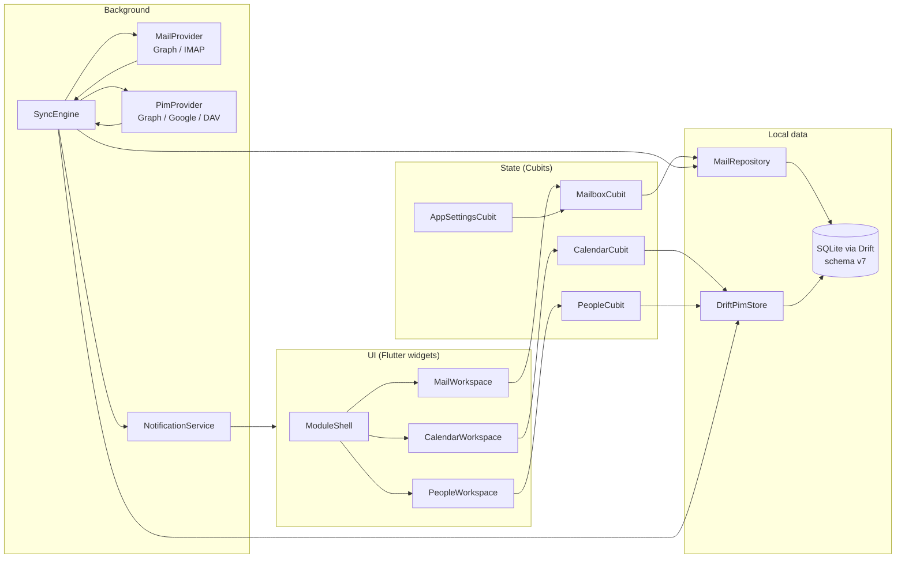

<p align="center">
  
</p>

# Dart in Synesis — A Curious Engineer's Tour

**For:** Trish (product owner, curious engineer) and anyone who wants to read the codebase without becoming a Dart expert first.

**Not:** A language textbook, the product spec, or end-user documentation. For architecture without code, start with [ARCHITECTURE_OVERVIEW.md](ARCHITECTURE_OVERVIEW.md). For requirements, see [SPEC.md](SPEC.md). For V2 wave status and PIM scope, see [V2_PLAN.md](V2_PLAN.md). For how the team builds, see [AGENTS.md](../AGENTS.md).

**Toolchain (Wave H, 2026-07-27):** Flutter **3.44.6** (`.flutter-version`), Dart SDK **`^3.12.2`** (`pubspec.yaml` `environment.sdk`).

---

## 1. Overview — Why Dart Here?

Synesis is a **local-first email + PIM client** for **Windows** and **Android**. V2 headline = **contacts and calendar** alongside mail. Dart is the language; **Flutter** is the UI toolkit that turns Dart into native apps on both platforms from one codebase.

That pairing is deliberate:

| Choice | What it means in Synesis | Why it exists |
| --- | --- | --- |
| **Flutter** | One UI codebase compiles to Windows desktop and Android mobile | Ship both v1 platforms without maintaining two separate front ends |
| **Local-first + SQLite (Drift)** | Everything on screen reads from a local database file | Inbox, contacts, and calendars open instantly; offline still works; no spinner while waiting on the server |
| **BLoC / Cubit** | Widgets paint state; Cubits own navigation and mutations | Predictable one-way flow — UI never "secretly" edits data |
| **Isolates** | Background workers for CPU-heavy MIME assembly | Keeps the UI thread free for 60fps scrolling while building outbound multipart messages |
| **Hybrid mail protocols** | `GraphMailProvider` vs `ImapSmtpMailProvider` behind one `MailProvider` contract | Exchange/Outlook use modern HTTPS Graph; Gmail and others use classic IMAP/SMTP — the UI never cares which |
| **Hybrid PIM protocols** | `GraphPimProvider`, `GooglePimProvider`, or `DavPimProvider` behind `ProviderRegistry.resolvePim()` | Graph accounts → Graph Contacts + Calendar; Google XOAUTH → People + Calendar API; IMAP/DAV accounts (e.g. Runbox) → CardDAV + CalDAV |
| **Outlook-style modules** | `ModuleShell` switches Mail / Calendar / People | V2 shell — mail remains cold-start default; PIM modules share the same local store |

**The golden rule:** The UI **reads** SQLite. The **SyncEngine** **writes** SQLite (and enqueues remote jobs). User actions like "mark read" or "toggle calendar display" update SQLite first (optimistic), then queue sync work for the server.

**V2 status (2026-07-27):** Waves 0, H, 1–5, and G are complete (**597** automated tests — see [TEST_INVENTORY.md](TEST_INVENTORY.md)). Wave 6 (cross-account DnD copy) is next. Drift schema is at **v7** (`contact_lists`, `contacts`, `calendars`, `events`, FTS, sync cursors).

**Google PIM honesty:** Wave G landed `GooglePimProvider` (People + Calendar API, not CardDAV). Automated tests and code review are green; operator dogfood for Google Calendar still requires **full app restart + re-auth** after the DEF-061 refresh-token fix — do not treat Google Calendar as production-proven until your account passes a live `calendars_*` sync. Google Calendar event sync is an MVP windowed snapshot (no persistent `syncToken` yet — see [V2_WAVE_G_QA.md](V2_WAVE_G_QA.md)).

---

## 2. Mental Model Diagram

When you wonder "where does this data come from?", trace this path:



**Mail read path:** Widget → Cubit → `MailRepository` → SQLite (often via a live `watchChanges` stream).

**PIM read path:** Widget → `CalendarCubit` / `PeopleCubit` → `DriftPimStore` → SQLite. PIM Cubits do **not** call providers directly — same local-first rule as mail.

**Write path (sync):** MailProvider / PimProvider → SyncEngine → Repository or PimStore → SQLite → stream fires → Cubit refreshes → UI repaints.

**Write path (user action):** Cubit → service layer (`MessageActionService`, display-pref toggles, …) → local SQLite patch → SyncEngine job queue → provider later.

---

## 3. Dart Concepts You'll See in Synesis

Each item below is **only** what appears in this repo — not the full Dart language.

### `async` / `Future` / `await`

**Future** = "a value that will arrive later" (like a Promise in JavaScript). **async** functions return Futures. **await** pauses until the Future completes — without blocking the UI thread.

**Synesis example:** `lib/main.dart` — startup is one long async chain: open SharedPreferences, open the database, wire SyncEngine and `DriftPimStore`, then `runApp(...)`. Nothing paints until the database and core services exist.

```dart
final SharedPreferences prefs = await SharedPreferences.getInstance();
final SynesisDatabase database = SynesisDatabase.open();
// ...
runApp(SynesisApp(...));
```

### `Stream` + `watchChanges` / `BlocBuilder`

A **Stream** emits events over time. Drift-backed repositories broadcast "something changed" so Cubits can refresh without polling.

**Synesis example:** `lib/repository/drift_mail_repository.dart` exposes `watchChanges()`. `lib/ui/mailbox/mailbox_cubit.dart` subscribes in `attachDbWatch()` and calls `refresh()` on each pulse. PIM Cubits call `refresh()` after local store mutations and on module open.

**BlocBuilder** (from `flutter_bloc`) rebuilds a widget when a Cubit emits new state — e.g. `MailWorkspace`, `CalendarWorkspace`, and `PeopleWorkspace` listen to their Cubits instead of calling `setState` for domain data.

### Null safety (`?`, `??`, `required`)

Dart 3 assumes values are non-null unless marked optional.

| Syntax | Meaning | Synesis touchpoint |
| --- | --- | --- |
| `String?` | Maybe null | `MailMessage.body` can be null until fetched |
| `??` | Default if null | Settings hydration: `map['themeId'] as bool? ?? true` in `app_settings_cubit.dart` |
| `required` | Constructor must receive this | Nearly every service constructor (`required MailRepository repository`) |

### `const` constructors

**const** widgets and objects are created at compile time and reused — cheaper rebuilds.

**Synesis example:** `MailboxState()` defaults, `NoopDesktopController()`, theme tokens — you'll see `const` on immutable UI shells and state snapshots throughout `lib/ui/` and `lib/settings/`.

### Isolates

An **Isolate** is a separate memory heap — true parallel work without sharing mutable state on the UI thread.

**Where Synesis uses them today:** `lib/mime/multipart_builder.dart` — `buildMultipartMessageInIsolate()` calls `Isolate.run()` to assemble outgoing MIME bytes before send. Sync and network I/O use **async/await** on the main isolate (sequential job loop in `sync_engine.dart`), but MIME assembly is the heaviest CPU path pushed off-thread.

### Packages vs `lib/`

| Location | Role |
| --- | --- |
| **`pubspec.yaml` + pub cache** | Third-party packages — see notable list below |
| **`lib/`** | Synesis source, imported as `package:synesis/...` |
| **`test/`** | Automated tests mirroring `lib/` structure (**597** cases as of Wave G) |

Your product code lives under `lib/`; packages are dependencies you don't edit.

**Notable dependencies (post–Wave H):**

| Package | Role in Synesis |
| --- | --- |
| `flutter_bloc` / `equatable` | Cubit state management |
| `drift` + `sqlite3` (sqlite3mc hook) | Type-safe SQLite; optional encryption via `hooks.user_defines` |
| `enough_mail` | IMAP/SMTP client |
| `http` / `oauth2` | Graph, Google, and DAV HTTP + OAuth |
| `xml` | CardDAV/CalDAV XML parsing |
| `connectivity_plus` | Network-aware sync policy |
| `flutter_secure_storage` | Credential vault |
| `flutter_widget_from_html` | HTML email rendering |

Wave H deferred some major bumps (e.g. `xml` ^7 blocked by `enough_mail`; `file_picker` pinned at 11.0.2) — see [WAVE_H_DEPENDENCY_HYGIENE.md](WAVE_H_DEPENDENCY_HYGIENE.md).

### Gold Master file headers

Core Dart files start with a comment block like:

```dart
// ==============================================================================
// File: lib/sync/sync_engine.dart
// Description: Sequential durable sync-job processor for local-first mail data.
// Component: Sync
// Version: 1.2 (Gold Master)
// ...
// ==============================================================================
```

**Gold Master** = reviewed, production-intent module (not a spike or placeholder). **Component** tells you which layer you're in: UI, Bloc, Data, Sync, Protocol, etc. When lost, read the header first.

---

## 4. Step-Through — Mail Path (V1 core, still the default module)

Follow this ordered path when exploring mail. Each stop: **role** and **why it exists**.

### Stop 1 — `lib/main.dart` (DI bootstrap)

**Role:** Application entrypoint. Initializes Flutter bindings, opens SQLite, constructs `MailRepository`, `DriftPimStore`, repositories, account service, provider registry, settings Cubit, desktop controller, notification service, and SyncEngine — then calls `runApp`.

**Why:** Keeps `app.dart` focused on widget tree wiring. All **dependency injection** (who gets which instance) happens here once. Also handles special cases: detached message windows on Windows, `.eml` file launch args, platform-specific notification adapters.

---

### Stop 2 — `lib/app.dart` (root MaterialApp + providers)

**Role:** Builds `SynesisApp` — `MultiRepositoryProvider` for services (`MailRepository`, `DriftPimStore`, `SyncEngine`, `AccountService`, …) and `MultiBlocProvider` for `AppSettingsCubit`, `MailboxCubit`, `CalendarCubit`, and `PeopleCubit`. Applies theme from settings and hosts `ModuleShell` as the home route.

**Why:** Flutter widgets can't reach into globals cleanly; providers expose services to the subtree. One place to see everything the UI layer is allowed to touch.

---

### Stop 3 — `lib/ui/shell/module_shell.dart` (V2 module switcher)

**Role:** Outlook-style shell: Mail (default cold start), Calendar, People. Swaps body widgets without tearing down shared providers.

**Why:** V2 product decision — PIM is first-class, but mail behavior in `MailWorkspace` stays unchanged under the hood.

---

### Stop 4 — `lib/settings/app_settings_cubit.dart` + `app_settings_state.dart`

**Role:** `AppSettingsCubit` loads and persists user prefs (theme, density, Focus toggles, retention, tray, notification filters, calendar view mode) via `SharedPreferences`. `AppSettingsState` is the immutable snapshot widgets and other Cubits read.

**Why:** Settings aren't in SQLite — they're device prefs. Separating state from mutations matches the BLoC pattern and makes tests easy.

---

### Stop 5 — `lib/ui/shell/mail_workspace.dart` (mail shell / shortcuts)

**Role:** The main three-pane mail shell: folder sidebar, message list, reading pane. Owns keyboard shortcuts, opens sheets (compose, search, sync status), and wires `MailboxCubit.attachDbWatch()` on init.

**Why:** One orchestration widget for mail navigation chrome so leaf panes stay dumb.

---

### Stop 6 — `lib/ui/mailbox/mailbox_cubit.dart` + `mailbox_state.dart`

**Role:** Brain of the mailbox UI: current account/folder, selection, message list projection, filters, snooze timers, and delegation to `MessageActionService` for mutations.

**Why:** Widgets shouldn't query SQLite or enqueue sync jobs. The Cubit centralizes "what is the mailbox showing right now?"

---

### Stop 7 — `lib/mailbox/message_action_service.dart` (mail mutations)

**Role:** Mark read/unread, star, move, archive, delete, junk, snooze, etc. Pattern: **patch local SQLite immediately** (optimistic UI), then **enqueue a SyncEngine job** — never block the UI on network.

---

### Stop 8 — `lib/repository/mail_repository.dart` + `drift_mail_repository.dart`

**Role:** Abstract mail contract (`listMessages`, `setUnreadBulk`, `enqueueSyncJob`, `watchChanges`, …) plus domain types. `drift_mail_repository.dart` implements via Drift store modules.

**Why:** UI and sync depend on an interface, not raw SQL. Tests use fakes without rewriting Cubits.

---

### Stop 9 — `lib/repository/database.dart` (Drift schema entry)

**Role:** Declares SQLite tables — mail (`Accounts`, `Folders`, `Messages`, sync jobs, outbox, FTS) **and PIM** (`contact_lists`, `contacts`, `contact_emails`, `contact_phones`, `calendars`, `events`, `event_attendees`, `contact_fts`). Schema version **7**. Generated companion: `database.g.dart`.

**Why:** Single schema source of truth. Migrations and type-safe queries flow from here.

---

### Stop 10 — `lib/sync/sync_engine.dart` (jobs)

**Role:** Background processor for durable sync jobs: mail fetch/send/mutations **and PIM bootstrap/incremental** (`pim_sync_jobs.dart` types). Writes fetched data into repositories; calls `onNewUnread` for fresh inbox mail.

**Why:** Network is slow and flaky — it must never run on the UI critical path.

---

### Stop 11 — `lib/protocol/mail_provider.dart` + Graph / IMAP providers

**Role:** Provider-neutral mail contract. `graph_mail_provider.dart` and `imap_smtp_mail_provider.dart` implement Exchange vs IMAP/SMTP. `ProviderRegistry.resolve()` picks the right one per account.

---

### Stop 12 — `lib/notifications/notification_service.dart`

**Role:** Receives new unread messages from SyncEngine. Applies filters (master toggle, per-account, starred-only, quiet hours, foreground suppression), then dispatches to platform adapters.

---

### Stop 13 — `lib/desktop/windows_desktop_controller.dart` (tray/toast seam)

**Role:** Windows `DesktopController`: system tray, minimize-to-tray, window focus tracking, toast hook. Non-Windows builds use `NoopDesktopController`.

---

### Stop 14 — `lib/ui/shell/reading_pane.dart` (representative mail UI leaf)

**Role:** Renders the selected message; calls back via callbacks (`onMarkRead`, `onArchive`, …) — does not touch the repository directly.

---

### Mail end-to-end narrative

1. **Open app** — `main.dart` opens DB, starts SyncEngine, `app.dart` mounts providers and `ModuleShell` (Mail default).
2. **See inbox** — `MailboxCubit.refresh()` reads via repository; `attachDbWatch()` keeps list live.
3. **Mark read** — Reading pane → Cubit → `MessageActionService` → local SQLite → sync job enqueued → UI updates immediately.
4. **Sync notifies** — SyncEngine fetches from Graph/IMAP → inserts rows → `onNewUnread` → `NotificationService` → OS notification if allowed.

---

## 5. Step-Through — PIM Path (V2)

PIM follows the same local-first rule. These stops pair with §4.

### Stop 15 — `lib/ui/calendar/calendar_cubit.dart` + `calendar_workspace.dart`

**Role:** `CalendarCubit` loads calendars and events from `DriftPimStore`, manages multi-calendar display prefs (overlay / side-by-side), and date-range queries. `CalendarWorkspace` is the month/week UI shell.

**Why:** Calendar UI never calls Graph/Google/DAV directly — it reads what SyncEngine already wrote.

---

### Stop 16 — `lib/ui/people/people_cubit.dart` + `people_workspace.dart`

**Role:** `PeopleCubit` lists contact lists and contacts, runs FTS search across selected lists, toggles display prefs. Used by the People module and the compose contact picker (`contact_picker.dart`).

---

### Stop 17 — `lib/repository/drift/drift_pim_store.dart`

**Role:** Drift-backed CRUD and queries for contact lists, contacts, calendars, events, display prefs, and FTS. The PIM equivalent of the mail store modules.

---

### Stop 18 — `lib/sync/provider_registry.dart` → PIM providers

**Role:** `resolvePim(accountId)` returns the right adapter:

| Account type | Provider | Protocol |
| --- | --- | --- |
| Graph / Microsoft | `GraphPimProvider` | Graph Contacts + Calendar API |
| Google XOAUTH (`google:` ref) | `GooglePimProvider` | People + Calendar API (Wave G) |
| IMAP + DAV credentials | `DavPimProvider` | CardDAV + CalDAV (Wave 4; Runbox dogfood) |

Google XOAUTH accounts **never** fall through to DAV — `resolvePim` returns `GooglePimProvider` before DAV discovery runs.

---

### Stop 19 — `lib/sync/pim_sync_jobs.dart`

**Role:** Job type constants (`contact_lists_bootstrap`, `contacts_incremental`, `calendars_incremental`, `events_incremental`, …) and per-collection sync cursor key helpers (`pim:contacts:{id}`, `pim:events:{id}`, …).

**Reserved no-ops until later waves:** `contacts_push`, `events_push`, `contacts_copy`, `events_copy` (Wave 6 DnD).

---

### Stop 20 — `lib/pim/meeting_invite_service.dart` (meeting-mail bridge)

**Role:** Wave 3 bridge — parses meeting invites in mail (`.ics`), surfaces accept/decline/tentative, drafts local calendar events from invite metadata. Graph RSVP path is live; Google Calendar RSVP is **not** in V2.0.

---

### PIM end-to-end narrative

1. **Add account / re-auth** — OAuth scopes include PIM where required (Graph: `Contacts.Read`, `Calendars.ReadWrite`; Google: `contacts.readonly`, `calendar`).
2. **SyncEngine enqueues PIM jobs** — bootstrap contact lists/calendars, then incremental pulls per collection.
3. **Provider fetches remote** — `GraphPimProvider`, `GooglePimProvider`, or `DavPimProvider` normalizes into local rows.
4. **DriftPimStore writes SQLite** — Cubits refresh; Calendar/People modules paint from local data.
5. **User toggles display** — Cubit → PimStore local pref update (no network until a future push wave).

---

## 6. How to Explore Safely

### Prefer Cubit state over hunting `setState`

Mailbox data → **`MailboxCubit` / `MailboxState`**. Calendar → **`CalendarCubit`**. People / picker → **`PeopleCubit`**. Settings → **`AppSettingsCubit`**.

### Where to look for bugs

| Symptom | Likely layer | Start here |
| --- | --- | --- |
| Wrong mail on screen, stale list | UI state / query | `mailbox_cubit.dart`, `message_query.dart` |
| Wrong contacts/calendars on screen | PIM Cubit / store | `calendar_cubit.dart`, `people_cubit.dart`, `drift_pim_store.dart` |
| Data wrong in DB but UI OK | Repository / store | `drift_*_store.dart`, `drift_pim_store.dart` |
| Server out of sync, jobs failing | Sync / provider | `sync_engine.dart`, `graph_mail_provider.dart`, `graph_pim_provider.dart`, `google_pim_provider.dart`, `dav_pim_provider.dart` |
| Google Calendar 403 after re-auth | OAuth / token lifecycle | `oauth_identity_manager.dart`, `edit_account_sheet.dart` (DEF-061 fix — needs full restart + re-auth) |
| CardDAV/CalDAV discovery failures | DAV protocol | `lib/protocol/dav/dav_discovery.dart`, `dav_pim_provider.dart` |
| Notification when you shouldn't get one | Notifications + settings | `notification_service.dart`, `app_settings_state.dart` |
| Windows tray / focus | Platform seam | `windows_desktop_controller.dart` |

### Don't edit `database.g.dart` by hand

It's **generated** by Drift from `database.dart`. Change the schema or queries in `database.dart` / store files, then run the build_runner command documented in project scripts (ask the team before running mutating codegen in CI).

### Running tests and finding coverage

```bash
flutter test
```

For the full catalog (**597** cases), see [TEST_INVENTORY.md](TEST_INVENTORY.md) and [`V1_AUTOMATED_TEST_INVENTORY.csv`](V1_AUTOMATED_TEST_INVENTORY.csv). V2 wave checklists (e.g. [V2_WAVE5_CHECKLIST.md](V2_WAVE5_CHECKLIST.md), [V2_WAVE_G_CHECKLIST.md](V2_WAVE_G_CHECKLIST.md)) link test IDs — they don't duplicate the whole file list. Historical V1 wave docs (W6 notifications, etc.) remain valid for mail subsystems.

---

## 7. What This Guide Is Not

| This guide | Look elsewhere |
| --- | --- |
| Dart language tutorial | [dart.dev](https://dart.dev/guides) |
| Product requirements & UX spec | [SPEC.md](SPEC.md) |
| V2 PIM wave plan & exit criteria | [V2_PLAN.md](V2_PLAN.md) |
| Architecture without code | [ARCHITECTURE_OVERVIEW.md](ARCHITECTURE_OVERVIEW.md) |
| End-user "how to use Synesis" | [USER_GUIDE.md](USER_GUIDE.md) · [QUICK_START.md](QUICK_START.md) |
| Manual QA click paths | [V1_MANUAL_E2E_MATRIX.csv](V1_MANUAL_E2E_MATRIX.csv) |
| Multi-agent team playbook | [MULTI_AGENT_SYSTEM_PROMPT.md](MULTI_AGENT_SYSTEM_PROMPT.md) · [AGENTS.md](../AGENTS.md) |
| Dependency upgrade log | [WAVE_H_DEPENDENCY_HYGIENE.md](WAVE_H_DEPENDENCY_HYGIENE.md) |

---

*Maintained by Page (documentation). Reviewed by Steve. Last updated: 2026-07-27 (V2 Waves 0–G refresh).*
