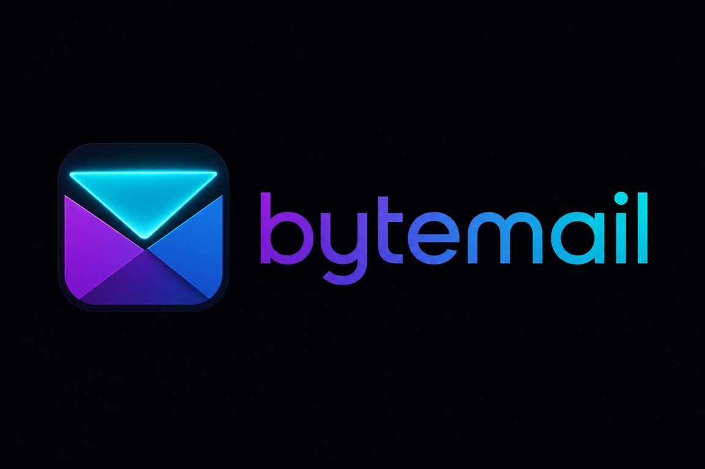

  

# ByteMail User Guide

Practical guide to using ByteMail on **Windows** and **Android**. For technical requirements see [SPEC.md](SPEC.md); for release status see [ROADMAP.md](ROADMAP.md).

**Quick path:** New here? Start with [QUICK_START.md](QUICK_START.md), then return here for detail.

---

## Accounts

ByteMail supports **Microsoft (Graph)**, **Google (OAuth → Gmail IMAP/SMTP)**, and **IMAP / Other** accounts.

1. Tap **Add account** from the title bar or Appearance settings.
2. Choose your provider tab and sign in (browser OAuth for Graph/Google) or enter IMAP/SMTP details.
3. On **IMAP / Other**, use **Look up settings** for Thunderbird-style autoconfig, or enter hosts manually.
4. After add, sync runs in the background — the inbox fills from your local cache first.

**Manage accounts:** Appearance → **Manage accounts** — edit label/accent, re-authenticate, or remove an account.

**Remove vs wipe:** Removing an account can optionally wipe its **local** mail cache, FTS index, outbox rows, and stored tokens. The provider mailbox is not deleted. See [Wipe](#wipe-local-data) below.

---

## Folders & the message list

- **Sidebar** — per-account folders plus virtual views: **Starred**, **Pinned**, **Snoozed**, **Trash**.
- **Unified Inbox** — merges all accounts when selected.
- **Threading** — on by default; toggle flat list in Appearance.
- **Date sections** — Today, Yesterday, This week, … are **grouping headers**, not separate filter modes.
- **Unread badges** — recount from local SQLite after sync.

**Actions (reading pane or keyboard on Windows):** reply, reply-all, forward, archive, move, star, delete (→ trash), recover, permanent delete, report junk / not junk.

**Mobile gestures:** swipe right = archive, swipe left = delete by default (configurable in Appearance). Pull down to refresh.

---

## Compose

Open compose from the title bar or reply/forward on a message.

- **To / Cc / Bcc**, subject, rich HTML body
- **Signatures** — pick per account; HTML signatures supported
- **Templates** — canned responses from the compose toolbar
- **Attachments** — paperclip to stage files; size limits follow your sync profile
- **Schedule send** — queues outbox with a future `send_after` time
- **Drafts** — autosaved locally in the outbox

Sends queue when offline and retry when connectivity returns.

---

## Search

**Local search (Ctrl+Shift+F / search icon):** Types into the SQLite FTS5 index — fast, works offline on synced mail.

**Remote search:** When available, use **Search older emails on the server** for archive mail not yet cached locally. Runs as a background job; results merge into the local DB.

Search is **separate** from list filters (below) and from Focus (below).

---

## Focus (Focused / Other)

Optional **inbox triage** — not the same as list filters.

- **Focused** — likely human / contact mail
- **Other** — automated mail, receipts, lists

Enable per account in Appearance; **Unified Inbox** has its own Focus toggle (independent of per-account settings).

**Override rules:** Settings → Focus rules — mark senders or domains as Always Focus or Always Other.

**Visual Focus** (layout): collapses sidebar + list for reading — title bar or Ctrl+Shift+M on Windows.

Focus applies **before** your list filter in the query stack. See [SPEC §8.3](SPEC.md#83-dual-layer-focus-mode-optional).

---

## Filters (list view)

Filters narrow the **current folder or unified list**. They do **not** move mail on the server.

### Ephemeral filters (chip bar)

Above the message list:

| Chip | Effect |
| --- | --- |
| **Unread** | Unread only |
| **Starred** | Starred only |
| **Has attachment** | Messages with attachments |
| **More** | Advanced sheet: sender, **recipient** (to/cc substring), date range, keyword |
| **Clear** | Removes active ephemeral filter — does **not** delete saved presets |

### Saved filters (named presets)

Tap **Saved** in the chip bar:

- **Apply** a saved preset — replaces the current ephemeral filter
- **Save current** — snapshot today's chip/advanced settings under a name (device-local; soft cap ~20)
- **Rename** or **Delete** saved definitions

**Clear vs delete:** **Clear** resets the active view filter only. **Delete** removes a saved preset from your device — it does not affect mail on the server.

Saved filters are stored in app preferences on **this device only** — not synced to providers or other devices in v1.

### How filters relate to Focus and search

| Feature | Scope | Persists? |
| --- | --- | --- |
| **Focus** | Focused/Other triage | Settings + override rules |
| **List filter** | Current folder/unified list | Ephemeral; optional saved presets |
| **Search** | FTS / remote archive lookup | Separate UI; not the chip bar |

See [SPEC §8.6](SPEC.md#86-message-list-filters-view-predicates).

---

## Settings

Open **Appearance** (palette icon) from the title bar.

| Area | What you can change |
| --- | --- |
| **Theme & density** | Five theme packs; Calm vs Compact spacing |
| **Reading pane** | Right / top / bottom layout (Windows) |
| **Threading** | Threaded vs flat |
| **Focus** | Per-account and Unified enablement |
| **Swipe actions** | Mobile gesture mapping |
| **Sync & storage** | Retention dial, sync profiles, folder scope, attachment cap |
| **Notifications** | Global off, per-account mute, quiet hours, starred-only |
| **Remote images** | Block by default; per-message load |
| **Encryption** | Opt-in SQLCipher for local DB (restart required) |
| **Tray** | Minimize to tray (Windows) |
| **Export / import** | Settings backup (no secrets) |
| **Manage accounts** | Edit, re-auth, remove |

**Sync status:** Title-bar sync chip → job queue and account health.

---

## Wipe (local data)

**Per-account wipe:** Manage accounts → Remove → confirm with typed gate (`WIPE {accountId}`). Clears that account's local messages, FTS entries, outbox, widget snapshots, and secure credentials.

**Diagnostics export:** Available for support — redacts secrets and message bodies by default.

Account wipe does **not** delete mail on your provider's server.

---

## Windows vs Android

| Topic | Windows | Android |
| --- | --- | --- |
| **Navigation** | Keyboard shortcuts (`?` for help), mouse, tray | Touch, back gesture, swipes |
| **Reading pane** | Split layouts; detached message window (one) | Portrait pager; adaptive toolbar at ≥520px |
| **Compose / search** | Ctrl+N, Ctrl+Shift+F | Title-bar actions |
| **Notifications** | Native toast | Notification channel + permission |
| **Splash / icon** | `.ico` + title-bar wordmark; **no** native splash | Minimal obsidian splash + adaptive launcher |
| **Widgets** | N/A (v1) | Home-screen list/counter/action widgets |
| **Background sync** | IDLE / Graph delta when focused | Battery-aware poll; push on cellular = setting |

---

## Branding

ByteMail ships the locked **Data Envelope v2** icon and **stealth lowercase `bytemail`** wordmark (gradient amethyst → blue → cyan).

- **Windows** — taskbar/window `.ico`; wordmark in the title bar
- **Android** — adaptive launcher, monochrome notification icon, minimal cold-start splash (dismisses on first app frame)

Details: [branding/README.md](branding/README.md).

---

## Related docs

| Doc | Purpose |
| --- | --- |
| [QUICK_START.md](QUICK_START.md) | Install → first sync in minutes |
| [SPEC.md](SPEC.md) | Full product specification |
| [ROADMAP.md](ROADMAP.md) | Wave status and exit gates |
| [DART_IN_BYTEMAIL.md](DART_IN_BYTEMAIL.md) | Engineer tour of the codebase |

*Maintained by Page. Last updated: 2026-07-18 (Final wave Phase E).*
